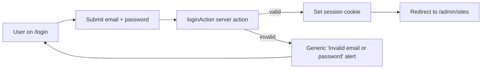
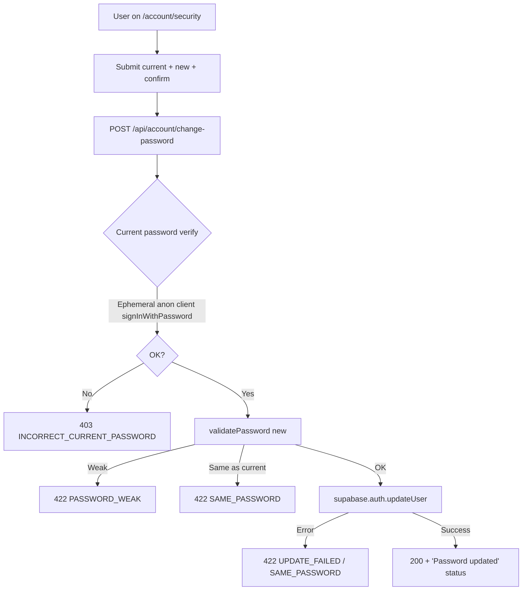
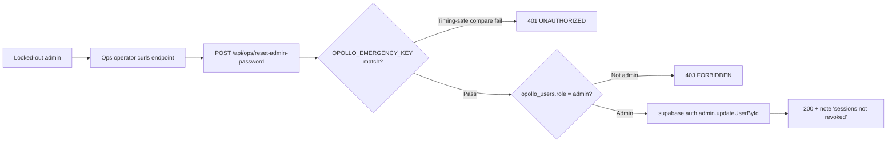
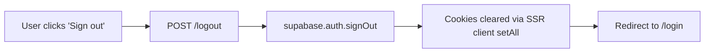
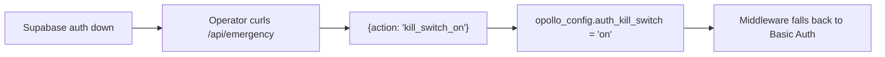

# Auth — flows + surfaces

Canonical map of every auth path in Opollo Site Builder. Updated after M14 completed the self-service recovery surfaces. If you add a new auth entry point or change a redirect, update this doc in the same PR.

## Milestones the surfaces ship from

- **M2** — foundation: Supabase-backed sessions, role matrix (admin / operator / viewer), admin gate (`lib/admin-gate.ts`, `lib/admin-api-gate.ts`), kill switch, revoke flow, invite flow.
- **M14-1** — permanent operator admin-reset endpoint, emergency-key-gated.
- **M14-2** — canonical auth-redirect helper + Supabase dashboard Site URL / Redirect URLs documentation.
- **M14-3** — self-service forgot-password + reset-password flow.
- **M14-4** — logged-in account-security password change (current-password-verified).
- **M14-5** — Playwright coverage of M14-3 + M14-4.

## Flows (mermaid)

### Login (M2)



- Entry: `/login` (`app/login/page.tsx` → `LoginForm`)
- Server action: `app/login/actions.ts::loginAction`
- Redirect target: `?next=<path>` or `/admin/sites`
- Forgot-password link under the Sign In button (M14-3 addition) → `/auth/forgot-password`

### Forgot password (M14-3)

```mermaid
flowchart TD
    A[User on /login] --> B[Click 'Forgot password?']
    B --> C[/auth/forgot-password]
    C --> D[Submit email]
    D --> E[POST /api/auth/forgot-password]
    E -->|rate limiter| F{5/email/hour?}
    F -->|OK| G[supabase.auth.resetPasswordForEmail<br/>redirectTo = NEXT_PUBLIC_SITE_URL/auth/callback<br/>?next=%2Fauth%2Freset-password]
    F -->|Denied| H["429 RATE_LIMITED → 'Too many reset requests'"]
    G --> I["Success envelope '(if an account exists, a link has been sent)'"]
    I --> J[User opens email]
    J --> K[Click recovery link]
    K --> L[Supabase /auth/v1/verify]
    L --> M[/auth/callback?code= or #access_token=]
    M --> N[Hash → setSession in browser; query → /api/auth/callback exchange]
    N --> O[Redirect to /auth/reset-password]
    O --> P[Enter new password + confirm]
    P --> Q[POST /api/auth/reset-password]
    Q --> R[Policy check + supabase.auth.updateUser]
    R --> S[Redirect to /admin/sites, signed in]
```

**No-enumeration contract:** `/api/auth/forgot-password` returns a success envelope whether or not the email is registered. Supabase failures are logged at warn but do not change the response shape.

**Expired / invalid link:** if the user lands on `/auth/reset-password` with no active session (link expired, already used, PKCE mismatch), the page renders a "Reset link expired" state with a "Request a new link" CTA back to `/auth/forgot-password`. Invalid codes hitting `/api/auth/callback` redirect to `/auth-error?reason=exchange_failed` (PKCE shape) or `/auth-error?reason=verify_failed` (OTP shape).

**Callback supports three link shapes.** Supabase emits one of three depending on the project's auth flow + email template configuration. All three land on `/auth/callback` (the client-side page) which dispatches:

- `?code=<uuid>` (PKCE) → forwarded to `/api/auth/callback` → `supabase.auth.exchangeCodeForSession(code)`
- `?token_hash=<hash>&type=<recovery|invite|signup|magiclink|email_change|email>` (OTP) → forwarded to `/api/auth/callback` → `supabase.auth.verifyOtp({ token_hash, type })`
- `#access_token=...&refresh_token=...&type=...` (implicit) → handled in-browser by `components/AuthCallbackClient.tsx` → `supabase.auth.setSession({ access_token, refresh_token })`

The implicit shape is the one that broke pre-2026-05: the server-only `/api/auth/callback` couldn't read URL fragments, so recovery clicks landed on `/auth-error?reason=missing_code` with the tokens stranded in the unreachable fragment. The new client page reads `window.location.hash`, sets the cookie session, and redirects.

Failure routing:
- Missing both query and fragment → `/auth-error?reason=missing_code`
- OTP `token_hash` with unknown `type` → `/auth-error?reason=invalid_type`
- PKCE exchange error → `/auth-error?reason=exchange_failed`
- OTP verify error → `/auth-error?reason=verify_failed`
- `setSession` error or `error=` in fragment → `/auth-error?reason=set_session_failed` (or the supabase-supplied reason)

The dual-path (page + API route) means template / flow changes on the Supabase side don't require a code redeploy. The decision logic lives in `lib/auth-callback.ts::planAuthCallback` as a pure function for unit-testing without a browser.

### Logged-in password change (M14-4)



The current-password probe uses an ephemeral anon client with `persistSession: false` and `autoRefreshToken: false` — it's a credential-validity check, not a sign-in. The user's existing session is never touched. A session hijacker with a stolen cookie cannot complete the flow without the original password.

Rate limiter: existing `login` bucket keyed on `user:<user_id>` (10/60s).

### Admin reset (M14-1) — ops break-glass



- Endpoint: `/api/ops/reset-admin-password` (permanent; not a one-off)
- Auth: `OPOLLO_EMERGENCY_KEY` header (`X-Opollo-Emergency-Key` or `Authorization: Bearer <key>`)
- Scope guard: target must be `opollo_users.role = 'admin'`, preventing emergency-key compromise from cascading into full tenant takeover
- Does NOT revoke existing sessions — chain with `POST /api/emergency {"action":"revoke_user"}` if the lockout is suspected compromise
- Full runbook: `docs/RUNBOOK.md` § "Admin locked out"

### Invite (M2)

```mermaid
flowchart TD
    A[Admin on /admin/users] --> B[Click Invite]
    B --> C[POST /api/admin/users/invite]
    C --> D[supabase.auth.admin.generateLink type=invite]
    D --> E[action_link returned]
    E --> F[Admin shares link with invitee]
    F --> G[Invitee clicks link]
    G --> H[/api/auth/callback?code=&lt;pkce&gt;]
    H --> I[exchangeCodeForSession + set cookie]
    I --> J[Redirect to ?next= or /]
```

The invite endpoint's `redirectTo` flows through `lib/auth-redirect.ts::buildAuthRedirectUrl` (M14-2) — canonical `NEXT_PUBLIC_SITE_URL` when set, request origin as fallback. Invites are NOT expirable or revocable in M14; see BACKLOG "Invite TTL + revocation."

### Logout (M2)



### Kill switch (M2c) — full-app break-glass



- Runbook: `docs/RUNBOOK.md` § "Auth is broken"
- `kill_switch_off` reverses; propagation is ≤5s per serverless instance.

## Middleware gate summary

`middleware.ts` runs on every request and routes to one of:

1. **Public path** (`PUBLIC_PATHS` set): proceed without session check.
   - `/login`, `/logout`, `/auth-error`, `/api/emergency`, `/api/health`, `/auth/forgot-password`, `/auth/reset-password`.
   - Also prefix-public: `/api/auth/*`, `/api/cron/*`.
2. **Kill switch on**: Basic Auth path (bypasses Supabase).
3. **Supabase auth on + no session**: 401 for API / redirect `/login?next=<path>` for HTML.
4. **Supabase auth on + wrong role**: 403 FORBIDDEN.
5. **Supabase auth on + revoked user**: 401 UNAUTHORIZED (revocation stamped on `opollo_users.revoked_at`).
6. **Supabase auth on + valid session**: proceed.

## Role matrix

| Role | Read | Write (own scope) | Write (any scope) | Admin routes |
| --- | --- | --- | --- | --- |
| viewer | ✓ | ✗ | ✗ | ✗ |
| operator | ✓ | ✓ | ✗ | some (per-route) |
| admin | ✓ | ✓ | ✓ | ✓ |

Source of truth: `supabase/migrations/0005_m2b_rls_policies.sql` at the DB layer; `lib/admin-gate.ts` + `lib/admin-api-gate.ts` at the app layer.

## Password policy (M14)

- Minimum 12 characters (NIST SP 800-63B § 5.1.1.2 — length beats character-class rules at equivalent friction).
- Maximum 256 characters.
- No whitespace-only.
- No complexity / composition rules.
- Source of truth: `lib/password-policy.ts`. Used server-side by M14-1 (`/api/ops/reset-admin-password`), M14-3 (`/api/auth/reset-password`), and M14-4 (`/api/account/change-password`). Client-side strength hint via `passwordStrengthHint()` in M14-3 and M14-4 forms.

## Auth-redirect helper (M14-2)

`lib/auth-redirect.ts::buildAuthRedirectUrl(path, req?)` — single source of truth for auth `redirectTo` URLs. Priority:

1. `NEXT_PUBLIC_SITE_URL` env (canonical, spoofing-immune).
2. Request origin fallback.
3. Throw `AuthRedirectBaseUnavailable` when neither is available (server actions, cron).

Any new auth route that issues a link must use this helper AND register the final URL in the Supabase dashboard's Redirect URLs allowlist — see `docs/RUNBOOK.md` § "Supabase Auth URL configuration".

## Structured logging (M14)

Every password-setting surface logs via `lib/logger.ts` with `{ request_id, user_id, email, outcome }`. **The password itself is never serialised into log payloads** — unit tests in each route's `*-route.test.ts` file assert this explicitly with a serialise-and-grep check.

Event names:

- `ops_reset_admin_password_success` / `*_unauthorized` / `*_not_found` / `*_wrong_role` / `*_update_failed` / `*_internal_error`
- `forgot_password_requested` / `*_rate_limited` / `*_supabase_error` / `*_internal_error`
- `reset_password_success` / `*_unauthenticated` / `*_supabase_error` / `*_internal_error`
- `change_password_success` / `*_incorrect_current` / `*_rate_limited` / `*_supabase_error` / `*_unauthenticated` / `*_internal_error` / `*_missing_email`

## What's NOT in scope

Deferred to BACKLOG post-M14:

- **Invite TTL + revocation.** Pick up trigger: admin mistakenly invites the wrong email and can't revoke.
- **Session expiry pre-warning.** Pick up trigger: operator loses mid-workflow state because of an expiry they didn't see coming.
- **MFA.** Its own milestone.
- **"Remember me" toggle.** Cookie sessions already persist.
- **Account deletion / GDPR export.** No public-user surface yet.
- **Email verification on signup.** Admin-invite-only today.
